# DELL 服务器 BIOS 配置 RAID 阵列(图文教程)

## 结论先行

DELL 服务器通过 **开机 F2 进入 BIOS → Device Settings → RAID Controller → Configuration Management** 配置 RAID 阵列。核心流程:进入 RAID 卡配置界面 → 创建虚拟磁盘 → 选择物理硬盘与阵列级别(RAID0/1/5/6/10) → 应用并初始化 → 验证磁盘 online 与容量正确。全程在 BIOS 物理界面操作,无需进入操作系统。

> 来源:博客园《DELL服务器BIOS下配置RAID阵列图文教程》(管先生, 2025-01),截图已存档,按知识库规范重新整理。

## ⚠️ 风险警告(操作前必读)

- **创建虚拟磁盘会清空所选物理硬盘上的全部数据**,生产服务器操作前**必须备份**,确认磁盘上无重要数据
- 配置过程涉及**物理硬盘状态变更**,误操作可能导致数据丢失或阵列不可用
- 建议在**服务器停机维护窗口**内操作,并提前记录原阵列配置(级别、磁盘、容量)
- 如服务器已有业务阵列,新增阵列时**只选择空余物理硬盘**,不要勾选已在用的磁盘

## 现象 / 适用场景

- 新装 DELL 服务器(如 PowerEdge R 系列)首次开机,需要配置 RAID 后安装系统
- 更换/新增硬盘后需要重新创建阵列
- 原有阵列损坏,需要重建

## 分步操作

### 第 1 步:开机按 F2 进入 BIOS 配置界面

开机出现 DELL Logo 时,按 **F2** 进入 System Setup(系统设置)界面。

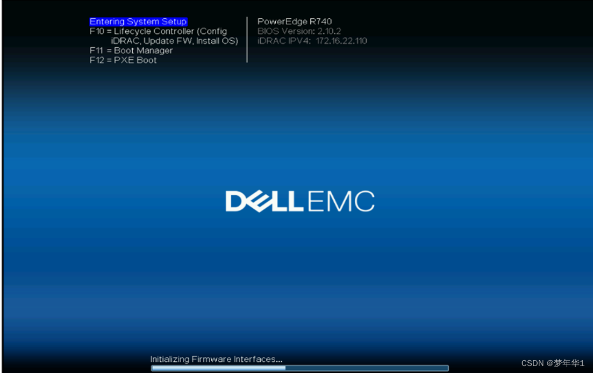

### 第 2 步:进入 Device Settings

在 System Setup 主界面,点击 **Device Settings**(设备设置)。

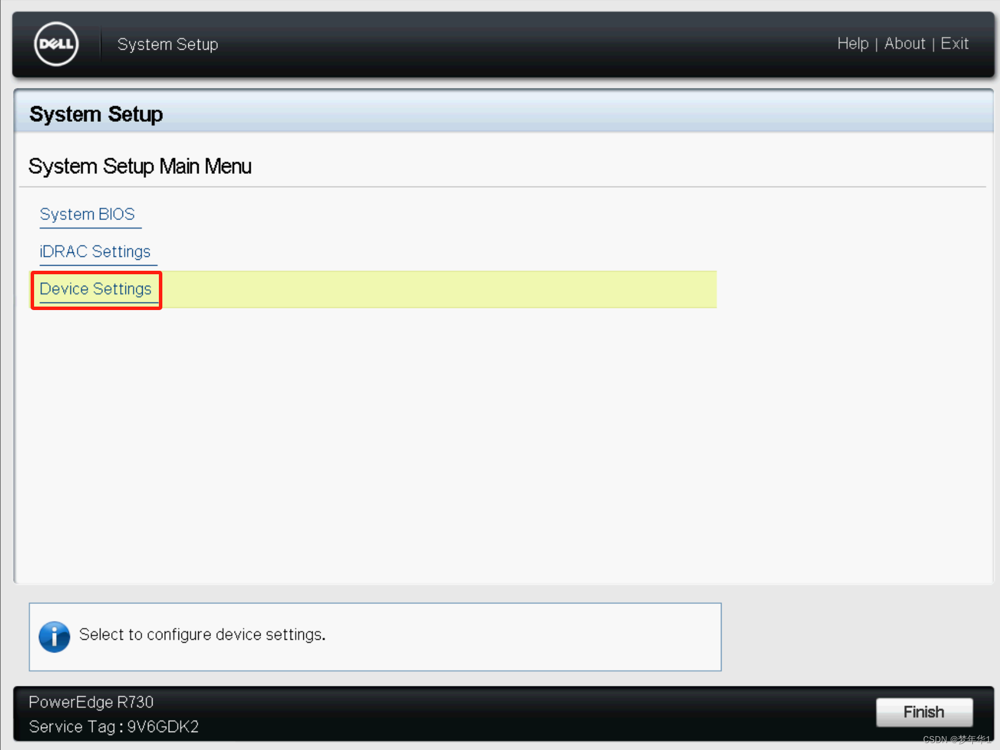

### 第 3 步:选择 RAID 控制器

点击 **RAID Controller in Slot 1**(插槽 1 的 RAID 卡),进入对应 RAID 卡(如 PERC H730/H740)的配置界面。不同型号 RAID 卡名称可能不同,选择实际安装的那张卡。

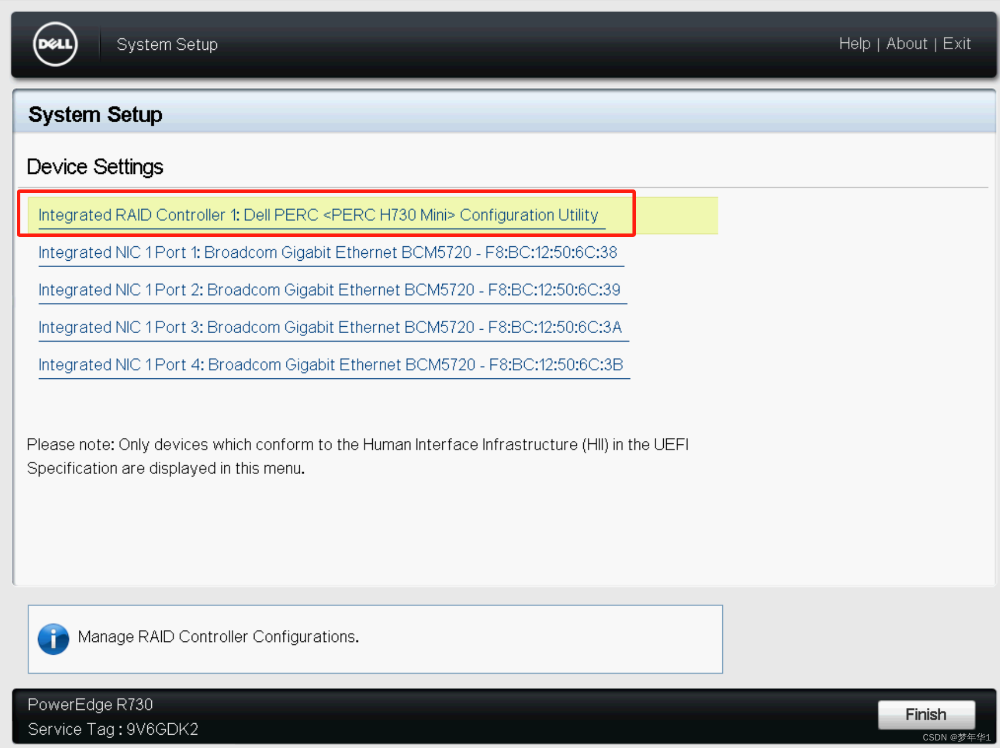

### 第 4 步:进入 Configuration Management

在 RAID 卡主界面,点击 **Configuration Management**(配置管理)。

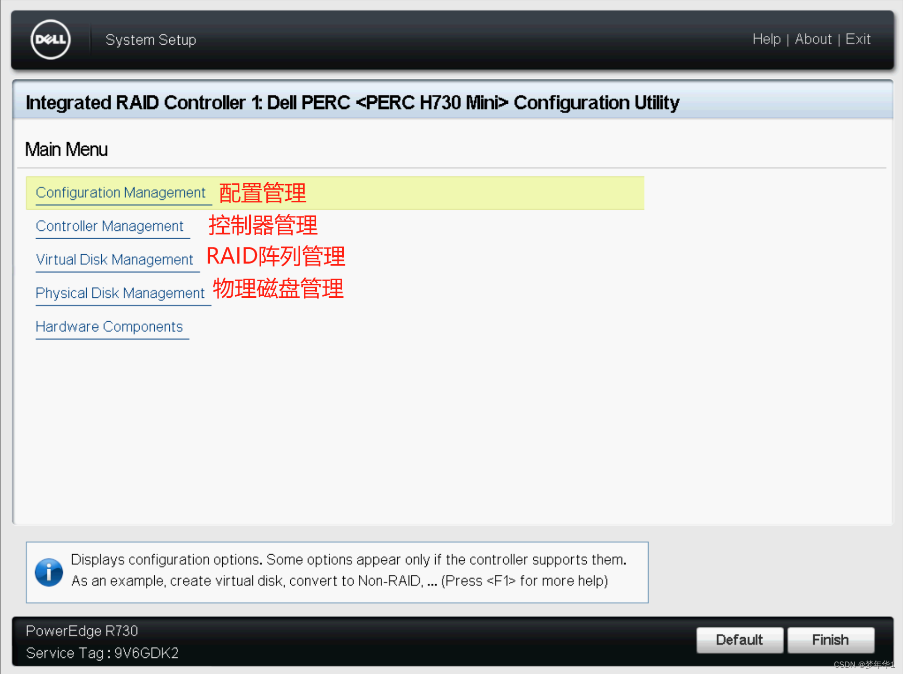

### 第 5 步:创建虚拟磁盘

点击 **Create Virtual Disk**(创建虚拟磁盘)。

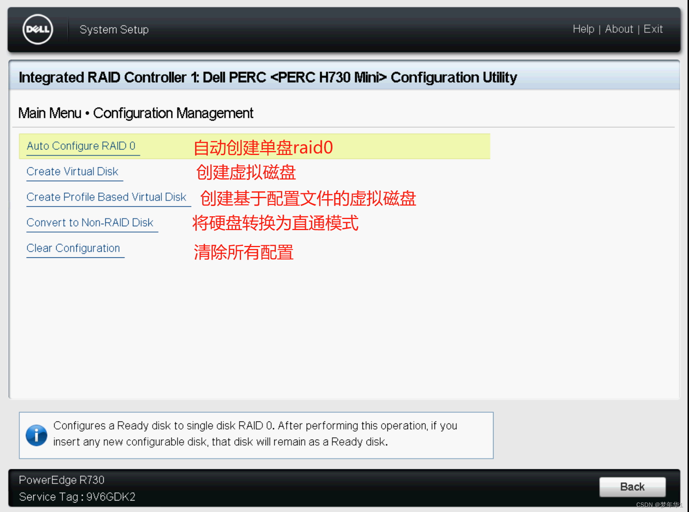

### 第 6 步:选择阵列配置与物理磁盘

- 先选择阵列级别(Raid Level):RAID 0 / 1 / 5 / 6 / 10 等
- 点击 **Select Physical Disks**(选择物理磁盘)进入磁盘选择

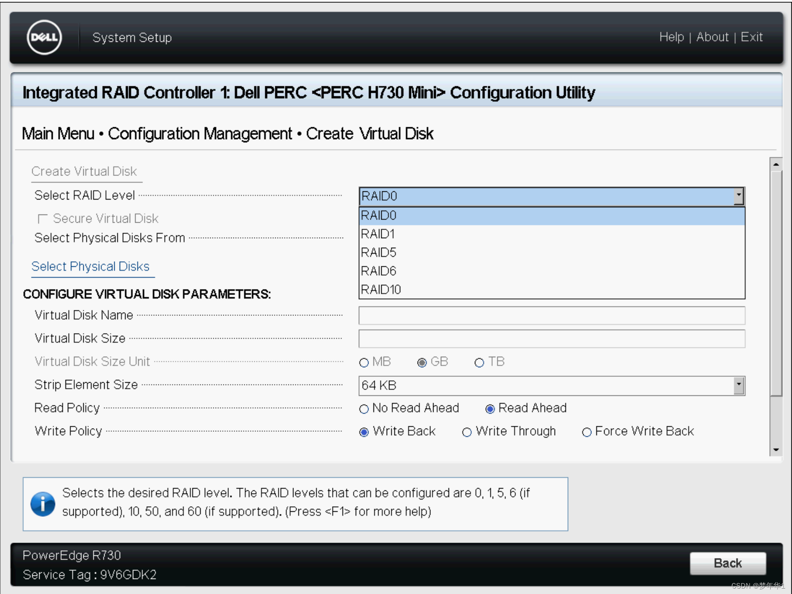

### 第 7 步:勾选硬盘并应用更改

勾选需要加入阵列的**本地物理磁盘**,点击 **Apply Changes**(应用更改)。

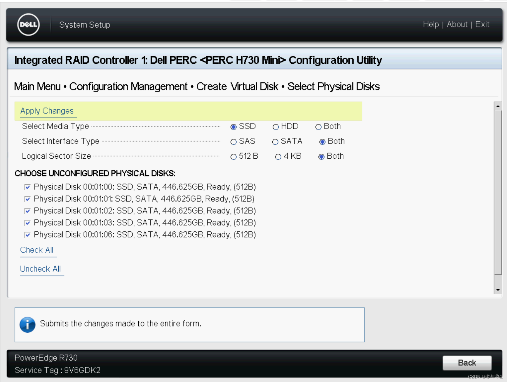

> ⚠️ 只勾选空余磁盘;若误选已有数据磁盘,数据将丢失。

### 第 8 步:确认并创建虚拟磁盘

点击 **Create Virtual Disk**(创建虚拟磁盘)完成创建。确认阵列级别、磁盘数量、容量无误后执行。

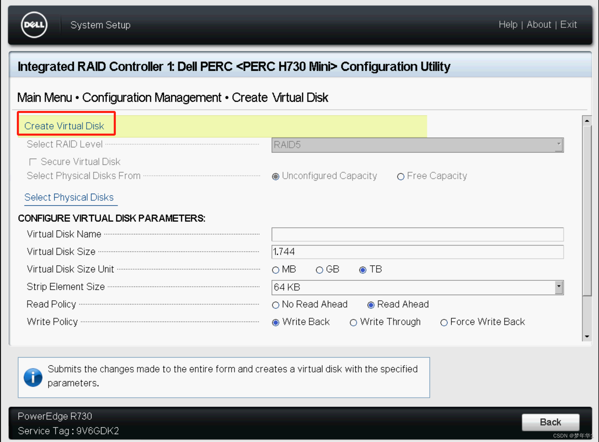

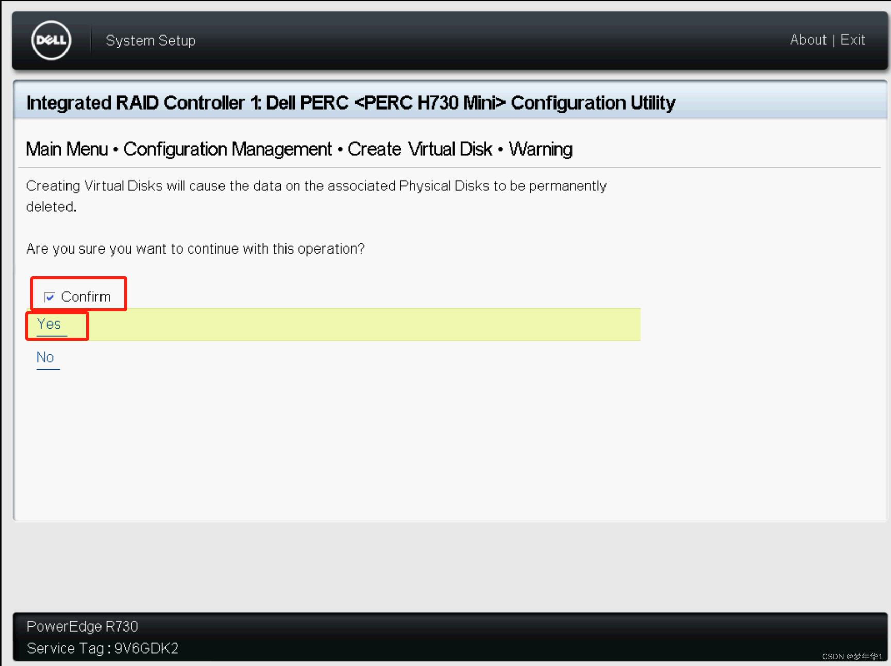

### 第 9 步:验证物理磁盘状态为 online

返回主界面查看 **Physical Disks**(物理磁盘)信息,确认所有磁盘状态为 **online**(在线)。

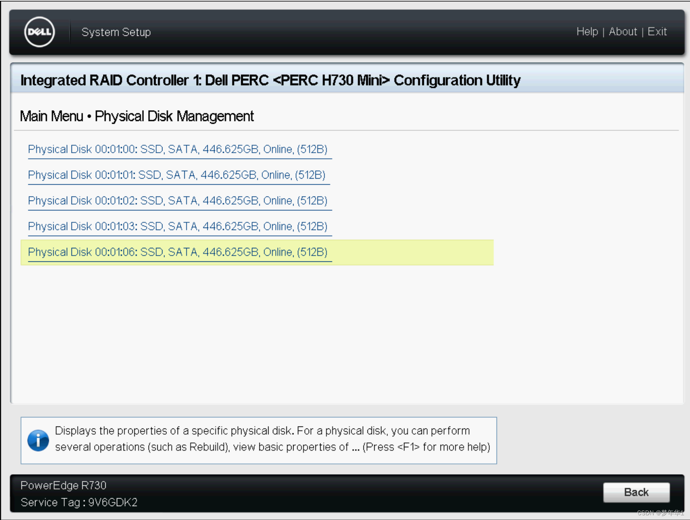

### 第 10 步:验证虚拟磁盘容量与阵列信息

查看 **Virtual Disks**(虚拟磁盘)信息,确认容量与阵列配置正确。

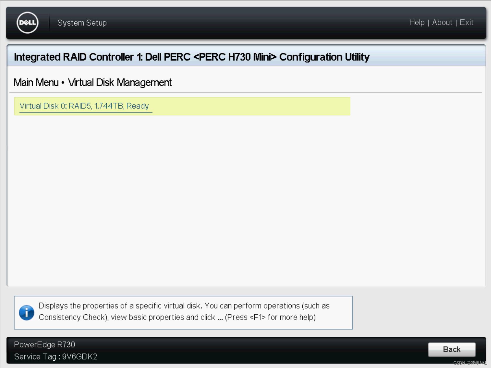

## 验证方法

1. **物理磁盘状态**:Physical Disks 页面所有磁盘显示 **online**,无 Failed/Degraded 状态
2. **虚拟磁盘信息**:Virtual Disks 页面显示正确的容量、阵列级别(RAID 级别)、状态为 Ready/Optimal
3. **退出 BIOS 重进**:保存退出后重新进入 Configuration Management,配置仍然存在
4. **系统安装验证**:进入操作系统后,系统能识别到对应容量的逻辑盘;Windows 磁盘管理 / Linux `lsblk` 可看到分区

## 注意事项 / 踩坑记录

- **F2 时机**:开机 Logo 出现后快速连按 F2,错过需重启重试;部分机型(如 R740)按 F2 进入的是主 BIOS,RAID 配置在 Device Settings 下的 RAID 卡界面
- **RAID 级别选择**:
  - RAID 0:条带,性能高、无冗余,2 块盘起
  - RAID 1:镜像,2 块盘,冗余 1 块
  - RAID 5:分布式奇偶校验,3 块盘起,允许坏 1 块
  - RAID 6:双奇偶校验,4 块盘起,允许坏 2 块
  - RAID 10:镜像+条带,4 块盘起,性能和冗余兼顾
- **控制器型号差异**:不同 PERC 卡界面菜单略有差异,但核心路径(Configuration Management → Create Virtual Disk)一致;H700/H710 旧卡界面较老,新卡(H740/H750)有图形化增强
- **初始化耗时**:大容量磁盘创建虚拟磁盘后,后台初始化(Background Initialization)需要时间,期间阵列性能会下降,属正常现象
- **不要中途断电**:初始化期间断电可能导致阵列状态异常
- 转载图文教程仅作操作流程参考,具体选项名称以实际机型 BIOS 为准

## 关联文档

- [RAID 故障灯码解读](RAID灯码-解读.md)
- 待积累:PERC 卡 RAID 配置命令行(perccli / MegaRAID Storage Manager)
- 待积累:RAID 阵列降级/重建流程(走 Hermes Skill `raid-troubleshooting`)
